# S&OP MVP Design Documentation

This document provides comprehensive design diagrams for the S&OP MVP application.

## Entity-Relationship Diagram (Database Schema)

## Sequence Diagram: Data Loading and PSI Calculation

## Sequence Diagram: Scenario Management

## Sequence Diagram: Plan Update

```mermaid
sequenceDiagram
    participant User
    participant SalesPage
    participant SOPContext
    participant API
    participant DB
    participant PSILogic

    User->>SalesPage: Edit sales quantity (M1: 200 → 250)
    SalesPage->>SOPContext: updateSalesPlan(updatedPlan)
    SOPContext->>SOPContext: setSalesPlan(updatedPlan)
    SOPContext->>PSILogic: calculatePSI(updatedPlan, productionPlan, logisticsPlan)
    PSILogic-->>SOPContext: newPsiResults
    SOPContext->>SOPContext: setPsiResults(newPsiResults)
    SOPContext-->>SalesPage: Re-render with updated data
    User->>SalesPage: Click "Save"
    SalesPage->>SOPContext: savePlans()
    SOPContext->>API: POST /api/data {scenarioId, salesPlan}
    API->>DB: saveSalesPlan(scenarioId, salesPlan)
    DB->>DB: BEGIN TRANSACTION
    DB->>DB: DELETE existing sales_plan for scenario
    DB->>DB: INSERT new sales_plan rows
    DB->>DB: COMMIT
    DB-->>API: Success
    API-->>SOPContext: {success: true}
    SOPContext-->>SalesPage: Show success message
```

## Use Case Diagram

## Component Architecture

## Data Flow: PSI Calculation

## Key Design Decisions

### 1. Dual Database Support
- **Local Development**: SQLite for zero-configuration setup
- **Production**: PostgreSQL for scalability and reliability
- **Implementation**: Environment-based switching via `DATABASE_URL`

### 2. Scenario Isolation
- Each scenario has independent plan data
- Cloning creates deep copies of all plan tables
- Transactions ensure data consistency during cloning

### 3. Real-time PSI Calculation
- Calculations performed client-side for instant feedback
- No server round-trip needed for plan updates
- Results cached in React context

### 4. Type Safety
- Explicit `Number()` conversion for PostgreSQL DECIMAL types
- Prevents string concatenation bugs in calculations
- Ensures consistent behavior across databases

### 5. API Design
- Single `/api/data` endpoint with action-based routing
- RESTful GET for reads, POST for writes
- Scenario ID as query parameter for data isolation
